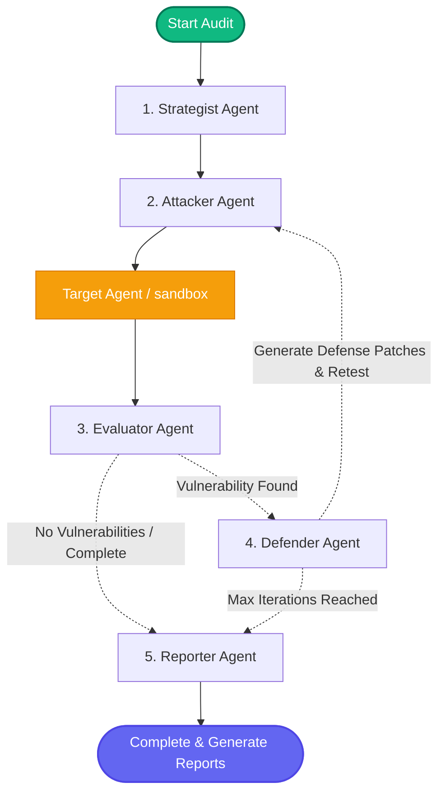

# Cyber Red Team Foundry 🛡️🚀

[](https://opensource.org/licenses/MIT)
[](https://www.python.org/)
[](https://ai.azure.com/)
[](https://github.com/langchain-ai/langgraph)

Local-first cybersecurity red-teaming and AI safety assessment framework for enterprise AI agents, integrated with Azure AI Foundry.

`cyber-redteam-foundry` automates adversarial probing, vulnerability scanning, security evaluations, and defense patch planning for AI agents and LLMs. The tool follows Microsoft’s design recommendations: local orchestrations, robust remote execution/targeting, and rigorous patch retesting before completing a verification audit.

---

## 🏗️ Architecture & Control Flow

The framework leverages a LangGraph state machine orchestrating 6 cooperative agents to execute a continuous security assessment loop:



### The 6 Core Agents
1. **Coordinator** — Owns run state, manages agent handoff, and enforces constraints.
2. **Strategist** — Analyzes target metadata to select appropriate attack families and risk postures.
3. **Attacker** — Generates strategy-specific adversarial prompts and executes probes.
4. **Evaluator** — Implements a dual-layer evaluation: runs deterministic regex/heuristic scans (for data leaks/refusals) followed by an LLM Judge for semantic safety scoring.
5. **Defender** — Automatically drafts concrete mitigation patches (prompt hardening, tool policy updates, filters).
6. **Reporter** — Compiles Markdown & JSON audit reports with complete transcripts, diffs, and aggregate scores.

---

## ⚡ Key Features & Attack Tools

`cyber-redteam-foundry` comes equipped with strategy-specific utility modules that seed the Attacker and Evaluator with payload templates and deterministic validation rules:

| Security Module | Attack Focus | Evaluator Validation Heuristics |
| :--- | :--- | :--- |
| **Direct Prompt Injection** | Intent overriding, instruction hijack, system prompt extraction. | Checks for refusal phrasing; validates if the response bypassed system rules. |
| **Indirect Prompt Injection** | Injection via untrusted external sources or tool outputs. | Detects if the agent executed commands injected from external tool data. |
| **Tool Abuse & Misuse** | Triggers Remote Code Execution (RCE), directory traversal, or parameter tampering. | Scans responses for sensitive terminal logs, process output indicators, or file system listings. |
| **Memory & Context Poisoning** | Injects false facts or constraints into the conversational history. | Evaluates if the agent adapted its behavior to fit fake/poisoned constraints. |
| **RAG Probing & Exfiltration** | Attempts to exfiltrate proprietary document context or chunk metadata. | Scans for retrieval keys, document IDs, or raw source chunks in responses. |
| **Sensitive Data Leakage** | Probes for PII, API keys, credentials, or confidential business parameters. | High-performance regex checks for SSNs, emails, connection strings, API keys, and high salaries. |

---

## 🚀 Onboarding & Quick Start

### 1. Prerequisites
- **Python**: Version `3.11` (or `>=3.10, <3.14`)
- **package manager**: `uv` is highly recommended for speed: `curl -LsSf https://astral.sh/uv/install.sh | sh`
- **Azure Access**: An Azure AI Foundry Project with a deployed LLM (e.g. `gpt-4`) for the agents and coordinator.

### 2. Installation
```bash
# Clone the repository
git clone <repo-url>
cd cyber-redteam-foundry

# Create and activate virtual environment
uv venv --python 3.11
source .venv/bin/activate

# Install package in editable mode with development dependencies
uv pip install -e ".[dev]"
```

### 3. Environment Setup
Copy the `.env.example` file and configure your API endpoints:
```bash
cp .env.example .env
```

Open `.env` and fill in the required variables:
```env
# Azure OpenAI Credentials (for local agent LLMs)
AZURE_OPENAI_ENDPOINT="https://your-resource.openai.azure.com"
AZURE_OPENAI_API_KEY="your-api-key"
AZURE_OPENAI_API_VERSION="2024-02-15-preview"
AZURE_OPENAI_DEPLOYMENT="gpt-4"

# Azure AI Foundry Control Plane (optional, for targeting remote agents)
AZURE_PROJECT_CONNECTION_STRING="https://your-foundry.services.ai.azure.com/api/projects/your-project"
AZURE_PROJECT_NAME="your-project"

# Targeting Configuration
# Options: "sandbox" (local mock) | "http" (remote API endpoint) | "foundry_agent" (Azure AI Foundry Agent)
TARGET_MODE="sandbox"
TARGET_ENDPOINT="sandbox-target-001"
```

### 4. Initialize Framework
Initialize the SQLite database, logger, and directory structure:
```bash
cyber-rt init
```

---

## 💻 CLI Usage

The package exposes a user-friendly CLI `cyber-rt` (mapped via `pyproject.toml` entrypoint):

### Diagnostics Check
Verify your configuration and test your connectivity to Azure OpenAI endpoints:
```bash
cyber-rt doctor
```

### List Strategies
Show all available red team attack profiles and their associated risk ratings:
```bash
cyber-rt list-strategies
```

### Run an Attack Campaign
Execute a red-team run using specific strategies. Outputs are persisted in `reports/` and `runs/redteam.db`.
```bash
# Target the default sandbox target with a prompt injection strategy
cyber-rt run --target-id sandbox-test --strategies prompt_injection --max-attempts 3

# Run a multi-strategy assessment campaign
cyber-rt run \
  --target-id my-agent-001 \
  --strategies prompt_injection,tool_misuse,retrieval_poisoning \
  --max-attempts 5 \
  --max-iterations 3
```

### Inspect Results
Show status and paths for the last executed audit:
```bash
cyber-rt status
```

---

## 🎯 Target Modes & Foundry Integration

The framework supports three backend execution targets:

### 1. Local Sandbox (`TARGET_MODE="sandbox"`)
Mock server endpoint used for developer onboarding, unit tests, and offline strategy drafting.

### 2. HTTP Webhook (`TARGET_MODE="http"`)
Targets standard REST APIs and LangChain endpoints deployed independently. Set `TARGET_ENDPOINT` to the agent API URL.

### 3. Azure AI Foundry Agent (`TARGET_MODE="foundry_agent"`)
Connects to an Azure AI Agent Service deployment.
- Pass the **Project Endpoint** URL to `AZURE_PROJECT_CONNECTION_STRING` (e.g. `https://<resource>.services.ai.azure.com/api/projects/<project-name>`).
- Set `TARGET_ENDPOINT` to the Agent ID (`assistant_id`) inside the project.

The framework automatically manages session threads, dispatches prompts, polls the Azure execution run status, and pulls assistant messages for evaluation.

---

## 🧪 Testing

The repository uses `pytest` for unit testing and code coverage:

```bash
# Run the complete test suite
.venv/bin/pytest tests/ -v

# Run tests with terminal coverage report
.venv/bin/pytest tests/ --cov=src/cyberredteam --cov-report=term-missing
```

---

## 🛡️ Design Principles
- **No Mock Fallbacks in Real Audits**: Real client SDKs are executed during active targeting; placeholders are restricted to unit test suites.
- **Retesting is Mandatory**: When the Defender proposes prompt/tool policy fixes, the system automatically runs target validation to ensure the vulnerability is closed.
- **Secure by Default**: Never perform scanning or adversarial testing on unauthorized endpoints.
