# Agent Canary

Agent Canary is an autonomous red-team platform for authorized HTTP-based AI agents. It uses a LangGraph workflow to generate adversarial prompts with NVIDIA Nemotron, send them to a real target, evaluate the target's real response, and persist evidence-backed findings for human review.

There are no mock attack results, static attacker payloads, sandbox targets, or automatic remediation paths in the production workflow.


## Live deployment

- Explainer: [agent-canary-explainer.vercel.app](https://agent-canary-explainer.vercel.app/)
- Interactive dashboard: [canary-coral.vercel.app](https://canary-coral.vercel.app/)
- AWS FastAPI docs: [3.108.23.172/docs](http://3.108.23.172/docs)
- Source: [github.com/Auro-rium/canary](https://github.com/Auro-rium/canary)

The dashboard is hosted on Vercel. The FastAPI backend runs separately on AWS and exposes only the API. Its root URL intentionally does not serve the UI. Vercel forwards API requests server-side and keeps the backend bearer token out of browser JavaScript.

The demonstration target is a separate project: [CompanyAgent Canary Demo](https://github.com/Auro-rium/companybot-canary-demo). It is a real LangChain tool-calling agent backed by Backboard and is assessed over HTTP at its `/chat` endpoint. Canary does not embed, modify, or fabricate this target. Assess only systems you own or are explicitly authorized to test.

## What happens during a campaign

```mermaid
flowchart LR
    start([Campaign request]) --> strategy[Deterministic strategist node]
    strategy -->|Send one branch per selected technique| attacker[Parallel Nemotron attackers]
    attacker --> target[Authorized HTTP target]
    target --> evaluator[Nemotron evaluator + deterministic detectors]
    evaluator -->|Finding and iterations remain| strategy
    evaluator -->|Complete| reporter[Nemotron reporter]
    reporter --> store[(SQLite evidence + reports)]
    store --> dashboard[React dashboard]
```



The four roles are:

| Role | Current behavior |
|---|---|
| Strategist | Deterministic graph node. Preserves the user's explicit technique selection and dispatches parallel branches. It does not make an unrecorded LLM selection. |
| Attacker | NVIDIA Nemotron generates one scoped adversarial prompt for one branch and sends it to the target adapter. |
| Evaluator | Deterministic detectors plus an NVIDIA Nemotron judge assess the target response, score it, record evidence, and decide whether another iteration is needed. |
| Reporter | NVIDIA Nemotron compiles the persisted campaign into Markdown and JSON report artifacts. |

The default model for all model-powered roles is `nvidia/nemotron-3-ultra-550b-a55b` through NVIDIA's OpenAI-compatible NIM endpoint. If `NVIDIA_API_KEY` is missing, the backend fails closed; it does not invent output.

## Attack coverage

The backend registry contains 12 strategy types. The current dashboard exposes these eight selectable techniques:

| UI technique | ASI mapping | Purpose |
|---|---|---|
| Prompt Injection | ASI-01 | Override system or developer instructions through user input. |
| Memory Poisoning | ASI-02 | Corrupt memory or state used in later reasoning. |
| Tool & Plugin Abuse | ASI-03 | Manipulate tool parameters or induce unauthorized actions. |
| Privilege Escalation | ASI-04 | Cross an authorization or role boundary. |
| Goal Hijacking | ASI-05 | Redirect the agent away from its declared task. |
| Data Exfiltration | ASI-06 | Probe for secrets, PII, prompts, or internal context. |
| Supply Chain Attack | ASI-08 | Poison retrieved or third-party tool content. |
| Agent DoS | ASI-09 | Induce runaway or resource-exhausting behavior. |

Explicit selections are preserved. LangGraph supports up to 12 parallel attacker branches; the UI currently exposes eight. The ASI/ATLAS mapping and confidence thresholds are stored in `cyber-redteam-foundry/configs/`.

## Target contract

The generic `HttpTargetAdapter` sends a POST request to an authorized target. By default:

```json
{"message": "<adversarial prompt>"}
```

The default response extractor checks `response`, `output`, `content`, and `text`. Campaigns can instead provide a JSON request template containing `{{PROMPT}}` and a dot path such as `choices.0.message.content`. Optional target headers are forwarded by the backend and are never bundled into the frontend.

The current demo target is:

```text
POST http://13.201.9.115/chat
{"message":"..."}
```

This endpoint belongs to the separate CompanyAgent deployment and may require its own authorization key.

## Local development

### Full Docker stack

Prerequisites: Docker Compose, an NVIDIA API key, an API bearer secret, and an authorized HTTP target.

```bash
git clone https://github.com/Auro-rium/canary.git
cd canary
cp cyber-redteam-foundry/.env.example cyber-redteam-foundry/.env
# Set NVIDIA_API_KEY, API_SECRET_KEY, and an authorized target configuration.
docker compose up -d --build
```

Local services:

| Service | URL | Purpose |
|---|---|---|
| React/nginx dashboard | http://localhost:8000 | Browser UI and `/api/*` proxy |
| FastAPI backend | http://localhost:8001/docs | Direct local API and Swagger UI |
| External target | configured by you | The agent being assessed; not bundled |

The AWS-style backend-only stack is:

```bash
docker compose -f docker-compose.yml -f docker-compose.aws.yml up -d --build redteam-backend
```

### Backend without Docker

```bash
cd cyber-redteam-foundry
uv venv --python 3.11
source .venv/bin/activate
uv pip install -e ".[dev]"
cp .env.example .env
cyber-rt init
cyber-rt doctor
cyber-rt server --port 8001
```

### Frontend without Docker

```bash
cd canary
npm install
npm run dev
```

Vite serves the dashboard at `http://localhost:5173` and proxies `/api` to the configured local backend. Production Vercel requests use the server-side proxy instead.

### Explainer locally and with Vercel CLI

The static explainer lives in `explainer/`:

```bash
cd explainer
npx vercel dev --local --listen 127.0.0.1:4173
```

For a production deployment, link the folder to the existing project once, then deploy:

```bash
npx vercel link --project agent-canary-explainer --yes
npx vercel --prod --yes
```

Do not commit `.vercel/`, `.env.local`, or provider credentials.

## Environment variables

The backend reads `cyber-redteam-foundry/.env`:

```env
NVIDIA_API_KEY=
NVIDIA_BASE_URL=https://integrate.api.nvidia.com/v1
API_SECRET_KEY=
ALLOWED_TARGETS=http://13.201.9.115/chat
REQUIRE_TARGET_ALLOWLIST=true
TARGET_MODE=http
TARGET_ENDPOINT=http://13.201.9.115/chat
TARGET_API_KEY=
MAX_RETRIES=3
MAX_CONCURRENT_RUNS=3
TIMEOUT_SECONDS=30
DB_PATH=runs/redteam.db
REPORT_OUTPUT_DIR=reports
REPORT_FORMAT=both
```

Production Vercel variables are server-only:

```env
CANARY_API_URL=http://<aws-backend-host>
CANARY_API_TOKEN=<same value as API_SECRET_KEY>
```

Never commit `.env` files, API keys, target credentials, or tokens in `VITE_*` variables.

## API surface

All protected backend routes require `Authorization: Bearer <API_SECRET_KEY>`.

| Method | Route | Purpose |
|---|---|---|
| GET | `/api/status` | Backend health and configuration status. |
| GET | `/api/dashboard/overview` | Aggregate campaigns, findings, targets, and LLM telemetry. |
| GET | `/api/runs` | Paginated campaign history with target/status filters. |
| POST | `/api/runs` | Start a background campaign. |
| POST | `/api/campaigns/run` | Start a campaign and stream SSE events. |
| GET | `/api/runs/{run_id}` | Complete campaign detail and evidence. |
| GET | `/api/runs/{run_id}/analysis-report` | Structured analysis report. |
| GET | `/api/runs/{run_id}/report-markdown` | Reporter Markdown artifact. |
| GET | `/api/runs/{run_id}/findings` | Findings linked to a campaign. |
| GET | `/api/targets` | Target portfolio summary. |
| GET | `/api/targets/{target_id}/coverage` | ASI coverage for a target; URL target IDs are supported. |
| GET | `/api/targets/{target_id}/trends` | Strategy success trends for a target. |
| GET | `/api/findings` | Paginated findings with severity/status/ASI filters. |
| GET | `/api/findings/{finding_id}` | Finding and latest evaluator verdict. |
| GET | `/api/findings/{finding_id}/attempts` | Contributing attempts. |
| PUT | `/api/findings/{finding_id}/status` | Manual finding lifecycle transition. |
| GET | `/api/open-findings` | All open findings. |
| GET | `/api/incidents` | Incident feed. |

## Evidence and safety boundaries

- The raw generated prompt, target reply, HTTP status, latency, request/response observations, detector indicators, evaluator verdict, and LLM call telemetry are persisted when available.
- Finding IDs are content-addressed from target, component, strategy, and ASI class so repeated observations can be deduplicated across runs.
- The attacker never decides whether an attack succeeded. The evaluator owns scores, verdict paths, and iteration routing.
- A refused attacker branch does not contact the target.
- Findings are manually triaged. Canary does not patch, disable, or remediate the target.
- Campaigns are only authorized assessments. The target allowlist should be enabled before exposing the API.

## Repository layout

```text
explainer/                  Static case-file explainer and Vercel config
canary/                     React 19 + TypeScript + Vite dashboard
cyber-redteam-foundry/      FastAPI + LangGraph engine
  src/cyberredteam/         Agents, graph, adapters, LLM, storage, API
  configs/                  Models, taxonomy, technique specs, thresholds
  prompts/                  Agent system prompts and report contracts
demo/demo.gif               Live dashboard GIF used in this README
runs/                       Local SQLite databases and logs; ignored
reports/                    Generated reports; ignored
```

## Validation

```bash
cd canary
npm run lint
npm run build

cd ../cyber-redteam-foundry
uv run --extra dev pytest tests/test_api.py tests/test_auth.py
```

The focused backend suite covers the API/auth surface, including URL target detail routes. Production inference is NVIDIA NIM; tests may inject fake LLMs or stores for isolation, but the deployed factory has no fabricated-output fallback.

## License

MIT. See [LICENSE](LICENSE).
