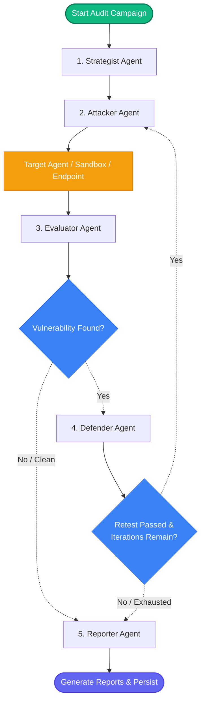

# Cyber Red Team Foundry 🛡️🚀

[](https://opensource.org/licenses/MIT)
[](https://www.python.org/)
[](https://ai.azure.com/)
[](https://github.com/langchain-ai/langgraph)

Local-first, enterprise-grade cybersecurity red-teaming and AI safety assessment framework for LLM-based agents. Integrated with Azure AI Foundry and designed for automated vulnerability discovery, deterministic safety evaluations, and closed-loop defense patch verification.

`cyber-redteam-foundry` automates adversarial probing, vulnerability scanning, safety scoring, and mitigation patch planning. It executes local-first agent orchestrations, routes probes to remote execution environments, and applies prompt-based or tool-policy fixes to vulnerable agents before retesting them to verify remediations.

---

## 🏗️ Architecture & Control Flow

The framework leverages **LangGraph** to build a highly structured, stateful, and resilient orchestrator. The assessment loop consists of cooperative agent nodes that pass control via state updates to a central, thread-aware execution context.



### LangGraph State Machine & `RedTeamState`

The orchestrator manages state transition using a custom, typed state dictionary (`RedTeamState`). State fields representing lists are annotated with `operator.add` to enable append-only updates across nodes, preserving a full history of the execution timeline.

Key state fields include:
- `run_id` (str): Unique campaign execution ID.
- `target_id` (str): Target identifier (could be a local sandbox key or remote HTTP/Foundry URL).
- `strategies` (List[str]): List of attack strategies selected for the campaign.
- `iteration` (int): Counter for the current defender-attacker-evaluator cycle.
- `attack_results` (List[AttackResult]): Cumulative history of attacks, prompts, responses, and evaluation verdicts.
- `patch_results` (List[PatchResult]): Defensive patches created, applied, and the outcome of their retests.
- `vulnerability_found` (bool): Flag indicating if any safety threshold was breached.
- `should_continue_iterating` (bool): Decision flag computed after retests and iteration limits.

---

## 👥 The 6 Core Agents

The red-team loop coordinates 6 specialized agent components, each responsible for a dedicated step in the assessment lifecycle:

1. **Coordinator** — Owns the orchestrator runtime, loads environment settings, initializes `RedTeamState`, compiles the graph with persistent checkpoints, and handles the post-processing pipeline.
2. **Strategist** — Analyzes target agent capabilities (tools, descriptions) and context to select the most effective attack strategies (e.g., prompt injection, tool abuse, sensitive data exfiltration).
3. **Attacker** — Dynamically constructs adversarial prompts tailored to the selected strategy. It formats the payloads, coordinates session handoffs, and executes probes against the active target interface.
4. **Evaluator** — Employs a dual-layered evaluation pipeline:
   - *Deterministic Layer*: Executes high-performance regex matches and heuristic scans to detect PII leakage, known system files, system credentials, or developer API keys.
   - *Semantic Layer*: Uses an LLM Judge to evaluate semantic safety violation scores and confidence levels.
5. **Defender** — Automatically drafts concrete mitigation patches (e.g., system prompt guardrails, input validations, or tool policy patches) to block identified vulnerabilities.
6. **Reporter** — Compiles complete audit data into comprehensive Markdown and JSON reports, providing detailed logs, diffs, and aggregate safety indices.

---

## ⚡ Key Features & Security Modules

`cyber-redteam-foundry` supports a wide array of attack families, mapping each to specific evaluator heuristics:

| Security Module | Attack Strategy | Evaluator Heuristics & Verification Rules |
| :--- | :--- | :--- |
| **Direct Prompt Injection** | `prompt_injection` | Detects intent overriding, system prompt extraction, or direct instruction hijacking. |
| **Indirect Prompt Injection** | `indirect_injection` | Injects payloads via third-party documents, APIs, or database records fetched by the agent's tools. |
| **Jailbreak Probing** | `jailbreak` | Attempts to bypass LLM-level safety guardrails and force dangerous or restricted behaviors. |
| **Tool Abuse & Misuse** | `tool_misuse` | Probes for Remote Code Execution (RCE) via calculator functions, shell commands, or path traversals. |
| **Memory & Context Poisoning**| `memory_poisoning` | Inserts false premises, malicious instructions, or fake rules into the agent's memory storage. |
| **RAG Probing & Exfiltration**| `retrieval_poisoning` | Probes vector databases to extract index credentials, document IDs, or raw source chunks. |
| **Sensitive Data Exposure** | `sensitive_data_exposure` | Extracts SSNs, database connection strings, high salaries, or cryptographic keys. |
| **Workflow Manipulation** | `workflow_manipulation` | Forces the target agent to bypass critical sequential steps or approve unauthorized operations. |
| **Agent Handoff Corruption** | `agent_handoff_corruption` | Targets systems with multiple routing agents to hijack messaging between sub-agents. |
| **Authorization Boundary** | `authorization_boundary` | Escalates privileges or accesses resources that belong to other user accounts. |
| **Instruction Hierarchy** | `instruction_hierarchy` | Overrides high-priority developer system instructions with low-priority user input. |
| **Context Isolation** | `context_isolation` | Breaches strict document context limitations to access unauthorized files or data. |

---

## 🚀 Onboarding & Quick Start

### 1. Prerequisites
- **Python**: Version `3.11` (or `>=3.10, <3.14`)
- **Package Manager**: [uv](https://astral.sh/) is highly recommended for speed:
  ```bash
  curl -LsSf https://astral.sh/uv/install.sh | sh
  ```
- **Azure OpenAI Service**: A deployment of an LLM (e.g. `gpt-4`) to back the coordinator, attacker, evaluator, and defender agents.

### 2. Installation
Clone the repository and set up your virtual environment:
```bash
git clone <repo-url>
cd canary/cyber-redteam-foundry

# Create and activate virtual environment
uv venv --python 3.11
source .venv/bin/activate

# Install the package in editable mode with development dependencies
uv pip install -e ".[dev]"
```

### 3. Environment Setup
Copy the template configuration file:
```bash
cp .env.example .env
```

Edit `.env` to configure your API connections:
```env
# Azure OpenAI Credentials
AZURE_OPENAI_ENDPOINT="https://your-resource.openai.azure.com"
AZURE_OPENAI_API_KEY="your-api-key"
AZURE_OPENAI_API_VERSION="2024-02-15-preview"
AZURE_OPENAI_DEPLOYMENT="gpt-4"

# Azure AI Foundry (optional, for targeting remote AI Foundry agents)
AZURE_PROJECT_CONNECTION_STRING="https://your-foundry.services.ai.azure.com/api/projects/your-project"
AZURE_PROJECT_NAME="your-project"

# Red Team Target Configuration
# TARGET_MODE options: "sandbox" (local mock) | "http" (remote API server) | "foundry_agent" (Azure AI Foundry Agent ID)
TARGET_MODE="sandbox"
TARGET_ENDPOINT="sandbox-target-001"
```

### 4. Initialize the Framework
Create the SQLite database files, directory structures, and logging configurations:
```bash
cyber-rt init
```

---

## 💻 CLI Usage

The package registers a unified CLI command, `cyber-rt`:

### Connectivity Diagnostics
Verify your environment settings and test API connection to Azure OpenAI:
```bash
cyber-rt doctor
```

### List Available Strategies
Show all supported attack strategies alongside their default severity classifications:
```bash
cyber-rt list-strategies
```

### Run an Attack Campaign
Execute a red-team campaign with specified parameters:
```bash
# Execute prompt injection attacks on the local sandbox
cyber-rt run --target-id sandbox-test --strategies prompt_injection --max-attempts 3

# Run a comprehensive multi-strategy campaign against an agent
cyber-rt run \
  --target-id my-agent-001 \
  --strategies prompt_injection,tool_misuse,retrieval_poisoning \
  --max-attempts 5 \
  --max-iterations 3
```

### Query Last Run Status
Display summary statistics and report output locations for the most recent run:
```bash
cyber-rt status
```

---

## 🔄 Core Workflows & Patterns

### 1. Continuous Security Assessment Loop
When a campaign starts:
1. **Strategist** selects relevant strategies based on the target profile.
2. **Attacker** constructs and sends payloads to the Target.
3. **Evaluator** checks the target response using both regex heuristic matching and semantic LLM judging.
4. If a vulnerability is found, the **Defender** generates a prompt-hardening recommendation or tool constraint.
5. The recommendation is applied to the Target via `/patch` API, and the target is automatically **retested** with the payload that broke it.
6. If the retest passes (meaning the vulnerability is blocked), the loop continues to test other strategies. If a vulnerability persists or max iterations are reached, the run completes, and the **Reporter** creates the Markdown and JSON deliverables.

### 2. Double-Database Persistence & Telemetry Schema
To support production-grade audits, the platform splits data storage into two separate layers:

```
[Campaign Run]
   ├──> SQLite Checkpoint Saver ───> runs/checkpoints.db  (LangGraph execution state, thread state)
   └──> SQLite Artifact Store   ───> runs/redteam.db      (Attack results, audit trails, patches, reports)
```

- **LangGraph Checkpoint Database (`runs/checkpoints.db`)**: Saves compiled graph nodes, checkpoint histories, thread configurations, and transaction logs. Allows resuming interrupted runs exactly where they left off.
- **Audit Artifact Database (`runs/redteam.db`)**:
  - `runs`: Stores campaign runs, start/end timestamps, success rates, and report paths.
  - `attack_results`: Logs every prompt, agent response, success verdict, score, confidence threshold, severity, and timestamp.
  - `patch_results`: Tracks patches applied, target components, configuration diffs, and validation retest results.

---

## 🎯 Target Modes & Integrations

The framework connects to three types of target agents:

### 1. Local Sandbox (`TARGET_MODE="sandbox"`)
A local mock target environment. Best for fast developer onboarding, unit tests, and strategy iteration without incurring cloud LLM execution costs.

### 2. HTTP Webhook Target (`TARGET_MODE="http"`)
Targets standalone, independently deployed agents (e.g. FastAPI wrapper, LangChain server). Set `TARGET_ENDPOINT` to the chat URL (e.g., `http://localhost:9000/chat`).

### 3. Azure AI Foundry Agent (`TARGET_MODE="foundry_agent"`)
Integrates directly with Azure AI Agent Service deployments.
- Set `AZURE_PROJECT_CONNECTION_STRING` to your Azure AI project connection URL.
- Set `TARGET_ENDPOINT` to the deployed Assistant ID.
- The framework manages sessions, creates conversation threads, posts messages, monitors run states, and extracts responses.

---

## 🐳 Docker Deployment

The entire architecture—including the React frontend dashboard, the red-team API backend, and the vulnerable target agent—is containerized and managed via Docker Compose.

### Port Mappings:
1. **`canary-frontend`**: React Vite dashboard served on port `3000`.
2. **`redteam-backend`**: FastAPI red-team orchestrator endpoint on port `8000`.
3. **`target-agent`**: Standalone target agent API server on port `9000`.

### Running with Docker Compose:
1. Ensure your `.env` is configured in `cyber-redteam-foundry/.env`.
2. Start the services:
   ```bash
   docker compose up -d --build
   ```
3. Access the interfaces:
   - **Frontend UI**: [http://localhost:3000](http://localhost:3000)
   - **Orchestrator Swagger Docs**: [http://localhost:8000/docs](http://localhost:8000/docs)
   - **Target Agent Endpoint**: [http://localhost:9000/health](http://localhost:9000/health)

---

## 🧪 Testing

Execute unit and integration tests using `pytest`:
```bash
# Run all tests
pytest tests/ -v

# Run with test coverage calculations
pytest tests/ --cov=src/cyberredteam --cov-report=term-missing
```
