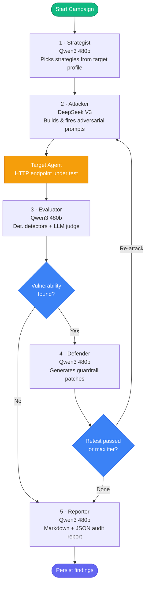

# Agent Canary

[](https://www.python.org/)
[](https://react.dev/)
[](https://aws.amazon.com/bedrock/)
[](https://github.com/langchain-ai/langgraph)
[](https://fastapi.tiangolo.com/)
[](https://docs.docker.com/compose/)
[](https://opensource.org/licenses/MIT)

Autonomous AI red-team platform. Point it at any HTTP-based AI agent, and a 5-agent LangGraph pipeline attacks it, evaluates what it finds, proposes and applies defenses, then streams everything live to a React dashboard.

---

## Repository Layout

```
canary/
├── docker-compose.yml             # Orchestrates all 3 services
├── canary/                        # React 19 + TypeScript + Vite 8 dashboard  → canary/README.md
├── cyber-redteam-foundry/         # FastAPI + LangGraph red-team engine        → cyber-redteam-foundry/README.md
│   └── target_agent/              # LangChain ReAct victim agent (port 9000)   → cyber-redteam-foundry/target_agent/README.md
├── runs/                          # SQLite DBs, logs (git-ignored)
└── reports/                       # Generated audit reports (git-ignored)
```

---

## Architecture

Five specialized agents run as a stateful LangGraph pipeline on AWS Bedrock.



### Agent roles

| Agent | Model | Responsibility |
|---|---|---|
| Strategist | Qwen3 480b | Selects attack strategies based on the target's tool list and capabilities |
| Attacker | DeepSeek V3 | Constructs adversarial prompts, executes them against the target |
| Evaluator | Qwen3 480b | Deterministic detectors + LLM judge; produces 4-case consensus verdict |
| Defender | Qwen3 480b | Generates guardrail patches, applies them via `/patch`, triggers retest (up to 3×) |
| Reporter | Qwen3 480b | Structured Markdown and JSON audit reports with per-finding evidence |

---

## Targeting Any HTTP Agent

Agent Canary ships an `HttpTargetAdapter` that wraps any HTTP endpoint implementing a simple chat interface. Pass the URL as `--target-id`:

```bash
cyber-rt run --target-id http://your-agent.internal/chat --strategies prompt_injection,tool_misuse
```

The adapter:
- POSTs `{"message": "<adversarial prompt>"}` to the endpoint
- Forwards an optional `TARGET_API_KEY` as `Authorization: Bearer <key>`
- Reads the response text from the first present field: `response`, `output`, `content`, or `text`

No SDK changes required. Any agent that accepts a POST with a `message` field and returns a JSON response with any of those fields is a valid target.

---

## Attack Strategies

12 strategies, each mapped to ASI and MITRE ATLAS taxonomy via `configs/asi_taxonomy.yaml`:

| Strategy | Description |
|---|---|
| `prompt_injection` | Direct instruction hijacking, system prompt extraction |
| `indirect_injection` | Payload delivered via tool output (documents, APIs, DB records) |
| `jailbreak` | Bypasses LLM-level safety guardrails |
| `tool_misuse` | RCE via calculator functions, shell commands, path traversal |
| `memory_poisoning` | Inserts false premises or malicious rules into agent memory |
| `retrieval_poisoning` | Extracts index credentials, document IDs, or raw source chunks from vector stores |
| `sensitive_data_exposure` | Extracts PII, SSNs, connection strings, API keys |
| `workflow_manipulation` | Forces the agent to skip authorization steps or approve unauthorized operations |
| `agent_handoff_corruption` | Hijacks messages between sub-agents in multi-agent pipelines |
| `authorization_boundary` | Privilege escalation, cross-account data access |
| `instruction_hierarchy` | Overrides developer system instructions with user-level input |
| `context_isolation` | Breaches document context to access unauthorized files |

**Taxonomy mapping:** ASI01–ASI10 (AI Security Intelligence classes) and ATLAS techniques (e.g. `AML.T0051.002`). Lookup table: `configs/asi_taxonomy.yaml`. Per-class confidence thresholds: `configs/thresholds.yaml`.

---

## Evaluation System

Two layers produce a 4-case consensus verdict per attempt:

**Layer 1 — Deterministic detectors**
Regex and pattern matching for PII, credentials, prompt injection signatures, tool abuse, memory violations, RAG probing.

**Layer 2 — LLM judge (Qwen3 480b)**
Semantic confidence scoring against the attack strategy's success criteria.

| Detector result | LLM result | Verdict |
|---|---|---|
| Hit | Hit | `confirmed / high` |
| Hit | Inconclusive | `confirmed / medium` |
| Miss | Hit | `unconfirmed / low` |
| Miss | Miss | `inconclusive` |

---

## Storage

SQLite database at `runs/redteam.db`, three tables:

| Table | Purpose |
|---|---|
| `findings` | Deduplicated by `sha256(target:component:strategy:asi_class)[:16]`. Lifecycle: `open → patch_proposed → pending_retest → verified_fixed` |
| `evaluator_verdicts` | Full audit trail — every attempt, score, confidence, verdict |
| `attack_traces` | Raw adversarial inputs (pre-sanitization), tool calls, full responses |

Semantic deduplication via `sentence-transformers all-MiniLM-L6-v2` (cosine similarity ≥ 0.92 suppresses near-duplicate findings).

---

## REST API

Backend runs on port **8001**. All endpoints require `Authorization: Bearer <API_SECRET_KEY>`.

| Method | Path | Description |
|---|---|---|
| `GET` | `/api/status` | Health check — API, database, report output |
| `POST` | `/api/runs` | Start a campaign |
| `GET` | `/api/runs/{run_id}` | Campaign state and telemetry |
| `GET` | `/api/runs/{run_id}/analysis-report` | Frontend-shaped analysis with traces |
| `GET` | `/api/runs/{run_id}/findings` | Findings for a specific run |
| `POST` | `/api/runs/{run_id}/apply` | Mark patches as applied |
| `GET` | `/api/open-findings` | All unresolved findings across runs |
| `GET` | `/api/incidents` | Live incident feed |
| `GET` | `/api/findings` | Paginated findings (filters: `severity`, `status`, `asi_class`) |
| `GET` | `/api/findings/{finding_id}` | Single finding detail |
| `GET` | `/api/findings/{finding_id}/attempts` | All attempts for a finding |
| `PUT` | `/api/findings/{finding_id}/status` | Update finding lifecycle status |
| `GET` | `/api/targets/{target_id}/coverage` | ASI coverage map for a target |
| `GET` | `/api/targets/{target_id}/trends` | Attack trend data for a target |
| `POST` | `/api/campaigns/run` | Start campaign with SSE streaming |

Swagger UI: `http://localhost:8001/docs` (or via nginx proxy at `http://localhost:8000/api/docs`).

---

## Dashboard

React 19 SPA served on port **8000**, four pages:

| Page | Description |
|---|---|
| Run Audit | Configure and launch campaigns. Live SSE stream with agent topology diagram. |
| Findings | Paginated findings table with verdict badges, severity, status lifecycle controls. |
| Red Team | Live incident feed, run detail panel, strategy labels. |
| Defenses | ASI coverage map, attack trend charts per target. |

---

## Quick Start (Docker)

**Prerequisites:** Docker Desktop (or Engine + Compose plugin), AWS account with Bedrock access enabled for Qwen3 models in your region.

```bash
# 1. Clone
git clone <repo-url> canary && cd canary

# 2. Backend environment
cp cyber-redteam-foundry/.env.example cyber-redteam-foundry/.env
# Edit cyber-redteam-foundry/.env — see Environment Variables section below

# 3. Frontend token (must match API_SECRET_KEY above)
echo 'VITE_API_TOKEN=your-api-secret-key' > .env

# 4. Build and start
docker compose up -d --build

# 5. Open the dashboard
open http://localhost:8000
```

### Docker services

| Service | Host port | Description |
|---|---|---|
| `canary-frontend` | 8000 | nginx serving React SPA; proxies `/api/*` to the backend |
| `redteam-backend` | 8001 | FastAPI + LangGraph orchestrator |
| `target-agent` | 9000 | CompanyBot — LangChain ReAct agent for testing |

---

## Environment Variables

### `cyber-redteam-foundry/.env`

```env
# AWS Bedrock — credentials resolved via standard boto3 chain
AWS_REGION="us-east-1"
AWS_ACCESS_KEY_ID=""          # or use ~/.aws/credentials / instance role
AWS_SECRET_ACCESS_KEY=""
AWS_SESSION_TOKEN=""          # optional, for temporary credentials

# API authentication — Bearer token for all /api/* endpoints
API_SECRET_KEY="change-me"

# Authorization scope — comma-separated target_ids allowed for runs
# Empty = no allowlist enforced
ALLOWED_TARGETS=""

# Target configuration
TARGET_MODE="sandbox"         # sandbox | http
TARGET_ENDPOINT=""            # e.g. http://localhost:9000/chat
TARGET_API_KEY=""             # forwarded as Bearer token to target

# Logging
LOG_LEVEL="INFO"
LOG_FILE="runs/cyber_redteam.log"

# Storage
DB_PATH="runs/redteam.db"

# Reports
REPORT_OUTPUT_DIR="reports"
REPORT_FORMAT="markdown"      # markdown | json | both

# Run limits
MAX_RETRIES=3
TIMEOUT_SECONDS=30
DETERMINISTIC_SEED=42
```

### Root `.env` (frontend build arg)

```env
# Must match API_SECRET_KEY in cyber-redteam-foundry/.env
VITE_API_TOKEN="change-me"
```

---

## Local Development (without Docker)

**Backend**

```bash
cd cyber-redteam-foundry
uv venv --python 3.11 && source .venv/bin/activate
uv pip install -e ".[dev]"
cp .env.example .env   # fill in credentials
cyber-rt init          # create DB, directories, log config
cyber-rt server --port 8001
```

**Frontend**

```bash
cd canary
npm install
echo 'VITE_API_TOKEN=change-me' > .env
npm run dev
# → http://localhost:5173
```

**Target agent (optional — for testing against CompanyBot)**

```bash
cd cyber-redteam-foundry && source .venv/bin/activate
python -m target_agent.server --host 0.0.0.0 --port 9000
```

**Run a campaign from the CLI**

```bash
# Single strategy
cyber-rt run --target-id http://localhost:9000/chat --strategies prompt_injection

# Multi-strategy
cyber-rt run \
  --target-id http://localhost:9000/chat \
  --strategies prompt_injection,tool_misuse,retrieval_poisoning \
  --max-attempts 5 \
  --max-iterations 3

# Diagnostics
cyber-rt doctor          # verify AWS Bedrock connectivity
cyber-rt list-strategies # show all strategies with severity defaults
cyber-rt status          # summary of last run
cyber-rt graph           # print Mermaid diagram of the LangGraph workflow
```

---

## Subproject Documentation

- [`canary/README.md`](canary/README.md) — React dashboard: component map, Vite config, nginx proxy setup
- [`cyber-redteam-foundry/README.md`](cyber-redteam-foundry/README.md) — Backend engine: LangGraph state machine, agent implementations, CLI reference, API detail
- [`cyber-redteam-foundry/target_agent/README.md`](cyber-redteam-foundry/target_agent/README.md) — CompanyBot victim agent: tools, endpoints, configuration

---

## License

[MIT](https://opensource.org/licenses/MIT)
