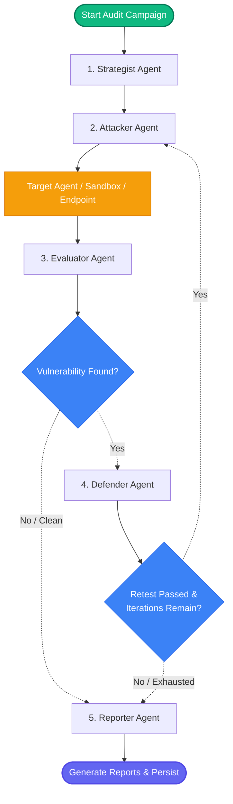

# Cyber Red Team Foundry — Backend Engine 🛡️⚙️

[](https://www.python.org/)
[](https://github.com/langchain-ai/langgraph)
[](https://fastapi.tiangolo.com/)
[](https://aws.amazon.com/bedrock/)

The core adversarial testing engine behind Agent Canary. This subproject implements the full red-team orchestration pipeline — from strategy selection through attack execution, evaluation, defense patching, and report generation — all powered by a LangGraph state machine and AWS Bedrock LLMs.

---

## 📁 Source Layout

```
cyber-redteam-foundry/
├── pyproject.toml                  # Package manifest (hatchling, deps, scripts)
├── Dockerfile                      # Python 3.11 container with CPU PyTorch
├── .env.example                    # Template for environment configuration
├── configs/
│   ├── models.yaml                 # Per-agent LLM model assignments
│   ├── asi_taxonomy.yaml           # ASI safety taxonomy definitions
│   ├── attack_profiles.yaml        # Attack profile configurations
│   ├── local.yaml                  # Local development overrides
│   ├── policies.yaml               # Security policy templates
│   └── thresholds.yaml             # Evaluation threshold settings
├── prompts/
│   ├── strategist.md               # Strategist agent system prompt
│   ├── attacker.md                 # Attacker agent system prompt
│   ├── evaluator.md                # Evaluator agent system prompt
│   ├── defender.md                 # Defender agent system prompt
│   ├── reporter.md                 # Reporter agent system prompt
│   └── orchestrator.md             # LangGraph orchestrator routing prompt
├── target_agent/                   # Standalone victim agent (see target_agent/README.md)
├── tests/                          # pytest test suite
├── runs/                           # Runtime artifacts (SQLite DBs, logs)
├── reports/                        # Generated audit reports (MD + JSON)
└── src/cyberredteam/
    ├── __init__.py                 # Package initialization
    ├── cli.py                      # Typer CLI (cyber-rt command)
    ├── api.py                      # FastAPI REST backend for the dashboard
    ├── settings.py                 # Pydantic settings from .env
    ├── schemas.py                  # Shared Pydantic data models
    ├── logging.py                  # Structured logging setup
    ├── agents/
    │   ├── __init__.py             # Agent exports
    │   ├── strategist.py           # Strategy selection agent
    │   ├── attacker.py             # Adversarial prompt construction agent
    │   ├── evaluator.py            # Dual-layer evaluation agent
    │   ├── defender.py             # Mitigation patch generation agent
    │   └── reporter.py             # Audit report compilation agent
    ├── attack_strategies/
    │   ├── __init__.py             # Strategy exports
    │   ├── registry.py             # Strategy registry & metadata
    │   ├── direct.py               # Direct prompt injection payloads
    │   ├── indirect.py             # Indirect prompt injection payloads
    │   ├── jailbreaks.py           # Jailbreak probing payloads
    │   ├── tool_misuse.py          # Tool abuse & RCE payloads
    │   └── retrieval_poisoning.py  # RAG/retrieval attack payloads
    ├── defense/                    # Defensive strategy modules
    ├── evaluation/                 # Heuristic & semantic evaluation logic
    ├── langgraph/
    │   ├── __init__.py             # LangGraph exports
    │   ├── state.py                # RedTeamState typed dict definition
    │   ├── graph.py                # Graph builder & node wiring
    │   ├── nodes.py                # Individual graph node implementations
    │   └── orchestrator.py         # GraphOrchestrator run coordinator
    ├── llm/                        # LLM provider abstraction (AWS Bedrock)
    ├── storage/                    # SQLAlchemy persistence layer
    └── tools/                      # Shared tooling utilities
```

---

## 🏗️ Architecture

### LangGraph State Machine

The orchestrator builds a compiled LangGraph that routes execution through 5 cooperative agent nodes. A central `RedTeamState` dictionary (with append-only list annotations) preserves the full execution timeline across checkpoint boundaries.



### `RedTeamState` Fields

| Field                        | Type                  | Purpose                                           |
| :--------------------------- | :-------------------- | :------------------------------------------------ |
| `run_id`                     | `str`                 | Unique campaign execution ID                      |
| `target_id`                  | `str`                 | Target identifier (sandbox key or HTTP URL)        |
| `strategies`                 | `List[str]`           | Selected attack strategies for the campaign       |
| `iteration`                  | `int`                 | Current defender→attacker→evaluator cycle count   |
| `attack_results`             | `List[AttackResult]`  | Cumulative history of attacks and evaluations     |
| `patch_results`              | `List[PatchResult]`   | Defensive patches and retest outcomes             |
| `vulnerability_found`        | `bool`                | Whether any safety threshold was breached         |
| `should_continue_iterating`  | `bool`                | Decision flag for continued iteration             |

---

## 👥 The 5 Core Agents

| # | Agent          | Responsibility                                                                       |
|---|----------------|--------------------------------------------------------------------------------------|
| 1 | **Strategist** | Analyzes target capabilities to select optimal attack strategies                     |
| 2 | **Attacker**   | Constructs adversarial prompts, formats payloads, and executes probes                |
| 3 | **Evaluator**  | Dual-layer evaluation — deterministic regex heuristics + semantic LLM judge          |
| 4 | **Defender**   | Drafts concrete mitigation patches (prompt guardrails, tool constraints)             |
| 5 | **Reporter**   | Compiles Markdown & JSON audit reports with aggregate safety indices                 |

Each agent's behavior is governed by a dedicated system prompt in `prompts/` and backed by an AWS Bedrock model configured in `configs/models.yaml`.

---

## ⚡ Supported Attack Strategies

| Strategy Key               | Category                    | Risk Level |
| :------------------------- | :-------------------------- | :--------- |
| `prompt_injection`         | Direct Prompt Injection     | High       |
| `indirect_injection`       | Indirect Prompt Injection   | High       |
| `jailbreak`                | Jailbreak Probing           | Critical   |
| `tool_misuse`              | Tool Abuse & RCE            | Critical   |
| `memory_poisoning`         | Memory & Context Poisoning  | High       |
| `retrieval_poisoning`      | RAG Probing & Exfiltration  | High       |
| `sensitive_data_exposure`  | Sensitive Data Exposure     | High       |
| `workflow_manipulation`    | Workflow Manipulation       | Medium     |
| `agent_handoff_corruption` | Agent Handoff Corruption    | Medium     |
| `authorization_boundary`   | Authorization Boundary      | Critical   |
| `instruction_hierarchy`    | Instruction Hierarchy       | High       |
| `context_isolation`        | Context Isolation            | Medium     |

---

## 🤖 LLM Configuration (AWS Bedrock)

Models are assigned per-agent in `configs/models.yaml`:

```yaml
strategist:
  model: qwen.qwen3-coder-480b-a35b-v1:0
attacker:
  model: qwen.qwen3-coder-30b-a3b-v1:0
evaluator:
  model: qwen.qwen3-coder-480b-a35b-v1:0
defender:
  model: qwen.qwen3-coder-480b-a35b-v1:0
reporter:
  model: qwen.qwen3-coder-480b-a35b-v1:0
```

Credentials are resolved via the standard `boto3` chain (environment variables `AWS_ACCESS_KEY_ID` / `AWS_SECRET_ACCESS_KEY`, shared credentials file, or instance/role profile).

---

## 🔑 Environment Configuration

Copy `.env.example` to `.env` and configure:

```env
# AWS Bedrock
AWS_REGION="us-west-2"
AWS_ACCESS_KEY_ID="your-aws-access-key"
AWS_SECRET_ACCESS_KEY="your-aws-secret-key"

# API Authentication (required for the FastAPI backend)
API_SECRET_KEY="your-random-api-token"

# Target Configuration
TARGET_MODE="sandbox"                            # sandbox | http
TARGET_ENDPOINT="http://localhost:9000/chat"      # used when TARGET_MODE=http
TARGET_API_KEY=""

# Authorization Scope (comma-separated allowed target IDs)
ALLOWED_TARGETS="http://localhost:9000/chat,sandbox-target-001"
```

---

## 💻 CLI Reference (`cyber-rt`)

The package registers a unified CLI via the `cyber-rt` entrypoint:

| Command              | Description                                               |
| :------------------- | :-------------------------------------------------------- |
| `cyber-rt init`      | Create SQLite databases, directories, and logging configs  |
| `cyber-rt run`       | Execute a red-team campaign with specified strategies     |
| `cyber-rt list-strategies` | Show all supported strategies with risk levels       |
| `cyber-rt status`    | Display summary of the most recent run                    |
| `cyber-rt graph`     | Print the LangGraph workflow as a Mermaid diagram         |
| `cyber-rt doctor`    | Verify environment settings and test Bedrock connectivity |
| `cyber-rt server`    | Start the FastAPI backend server for the dashboard        |

### Examples

```bash
# Initialize the environment
cyber-rt init

# Run a prompt injection campaign against the local sandbox
cyber-rt run --target-id sandbox-test --strategies prompt_injection --max-attempts 3

# Multi-strategy campaign against a live target agent
cyber-rt run \
  --target-id http://localhost:9000/chat \
  --strategies prompt_injection,tool_misuse,retrieval_poisoning \
  --max-attempts 5 \
  --max-iterations 3

# Start the API server for the frontend dashboard
cyber-rt server --port 8000
```

---

## 🌐 FastAPI REST API

The backend (`cyberredteam.api`) serves the Agent Canary dashboard frontend. All routes require `Authorization: Bearer <API_SECRET_KEY>`.

| Method | Endpoint                             | Purpose                                  |
| :----- | :----------------------------------- | :--------------------------------------- |
| `GET`  | `/api/status`                        | Health check & system status             |
| `POST` | `/api/runs`                          | Launch a background campaign thread      |
| `GET`  | `/api/runs/{run_id}`                 | Fetch run state and telemetry            |
| `GET`  | `/api/runs/{run_id}/analysis-report` | Pull analysis details & policy YAML      |
| `GET`  | `/api/open-findings`                 | List unresolved vulnerabilities          |
| `POST` | `/api/runs/{run_id}/apply`           | Mark patches as applied                  |
| `GET`  | `/api/incidents`                     | Live incident telemetry feed             |

---

## 💾 Data Persistence

The platform uses a dual-database architecture:

```
[Campaign Run]
   ├──> SQLite Checkpoint Saver ───> runs/checkpoints.db  (LangGraph execution state)
   └──> SQLite Artifact Store   ───> runs/redteam.db      (Audit trails, attacks, patches)
```

- **`runs/checkpoints.db`**: LangGraph checkpoint histories and thread state for resuming interrupted runs.
- **`runs/redteam.db`**: Campaign runs, attack results, patch results, and report metadata.

---

## 🐳 Docker

The `Dockerfile` builds a Python 3.11 slim image with CPU-only PyTorch:

```bash
# Build the image
docker build -t redteam-backend .

# Run standalone
docker run -p 8001:8001 --env-file .env redteam-backend

# Or via docker compose (from repo root):
docker compose up -d redteam-backend
```

**Exposed ports**: `8001` (FastAPI API), `9000` (target agent).

---

## 🧪 Testing

```bash
# Run all tests with coverage
pytest tests/ -v --cov=src/cyberredteam --cov-report=term-missing

# Run a specific test file
pytest tests/test_evaluator.py -v
```

---

## 🚀 Quick Start

```bash
# 1. Install uv (recommended)
curl -LsSf https://astral.sh/uv/install.sh | sh

# 2. Create venv and install
uv venv --python 3.11
source .venv/bin/activate
uv pip install -e ".[dev]"

# 3. Configure environment
cp .env.example .env
# Edit .env with your AWS credentials and API key

# 4. Initialize
cyber-rt init

# 5. Verify connectivity
cyber-rt doctor

# 6. Run your first campaign
cyber-rt run --target-id sandbox-test --strategies prompt_injection
```
